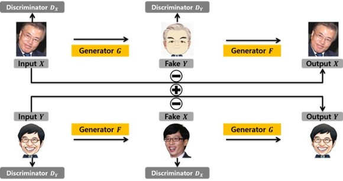

# Project_CaricatureGAN
Minso Jeong, WISET 

Converting Portrait into Caricature using Cycle-GAN:

> **Converting Portrait into Caricature using Cycle-GAN**   
> Minso Jeong,  
> WISET, 대한전자공학회

Contact : [minso.jeong@daum.net](mailto:minso.jeong@daum.net)

## Updates

## Abstract
In this paper, we construct a database for converting portraits into caricatures and propose the method which converts portraits into caricatures using Cycle-GAN. First, in this paper, we use the unpaired image data set, and database for converting portraits into caricatures consist of portraits and caricature images collected online. Next, we develop the network for converting portraits into caricatures based on Cycle-GAN. Through the experimental results, it was confirmed that the superiority of the proposed method.

## Results
comming soon⏳ - 저작권 문제로 결과 이미지 당사자의 허가 후에 업로드하겠습니다. 

## Installation
comming soon⏳

## License
comming soon⏳

## Citation
comming soon⏳
